# The migration of "had"
### Structural changes in the novel from 1840 to 2000

# 1

At the beginning of "A Introduction to the Structural Analysis of Narrative," Barthes' contribution to the 1966 special issue of *Communications* that would later seem like a crossroads in the history of narrative theory in the 20th century, Barthes begins by warning of the difficulties of taking an "inductive" approach to studying narrative:

> Many commentators, who admit the idea of a narrative structure, are nevertheless reluctant to cut loose literary analysis from the model used in experimental sciences: they boldly insist that one must apply a purely inductive method to the study of narrative and that the initial step must be the study of all narratives within a genre, a period, a society, if one is to set up a general model. This commonsense view is, nonetheless, a naive fallacy. Linguistics, which only has some three thousand languages to contend with, failed in the attempt; wisely, it turned deductive, and from that day on, incidentally, it found its proper footing and proceeded with giant steps, even managing to anticipate facts which had not yet been discovered. What then are we to expect in the case of the analysis of narrative, faced with millions of narrative acts? [...] It is only at the level of such conformities or discrepancies, and equipped with a single tool of description, that the analyst can turn his attention once more to the plurality of narrative acts, to their historical, geographical, and cultural diversity.

It is interesting that Barthes frames this as essentially a practical problem -- there are simply too many texts, too many narratives, such a large quantity of narrative "diversity" that to try to make sense of them all at once by way of some kind of ground-up, "inductive" approach would be to drown in the sea of information. What's needed instead is a single understanding of how narratives work -- a deductive theory, like Saussurean linguistics, a unified template for narratives. Once this is hand, only then would it be feasible to turn to the sea of narratives in all of their "diversity" and begin to grapple with the exceptions to the rule, the axes of difference across history, geography, and culture. The deductive turn -- and by extension, the turn away from any kind of historically or culturally grounded definition of narrative -- is presented here as much as anything else as a tactical decision, a response to a problem of *scale*.

In 2016 -- exactly fifty years after the original publication of Communications 8 -- we have a new set of computational tools that do, in many ways, open the door to the type of ground-up, inductive approach that Barthes warned against. And, sure enough, in recent years there as been a surge of interest in what might be thought as a "computational narratology," an effort to reason empirically about the internal structure of literary texts. Most notable is probably Matt Jockers' work with Syuzhet, a piece of software that uses a "sentiment analysis" algorithm to score the positive or negative valence -- essentially the extent to which the text is "happy" or "sad" -- over a series of slices in the text running from the beginning to end, which Jockers argues can serve as a proxy for a general notion of "plot movement." Andrew Piper, writing in a recent issue of *New Literary History*, analyzes Augustine's *Confessions* and distills out a semantic signature for the "conversional" narrative -- one in which there is a rapid shift in the semantic register of the text around the 70% mark, the moment of conversion -- and traces this signature forward in literary history to identify other conversional texts, texts that share this internal topology. Ben Schmidt, following in Jockers' footsteps, trained topic models on a corpus of TV scripts and then looked at the distribution of different topics across the narrative interval of the scripts, and was able to empirically observe the intuitive structure of cop dramas, with a crime at the beginning and a trial at the end. Meanwhile, at the Literary Lab at Stanford, the Suspense project has developed a neural network that is capable of scoring a passage of text as "suspenseful" or "unsuspenseful," and this signal is then tracked across novels. In pamphlet 7, Holst Katsma identifies a vocabulary of "volume" in the novel -- whether dialogue is described as loud or soft -- and uses this to track the overall loudness of across the first book of the Idiot. And in corpus linguistics and computer science there is an older tradition (though with a more applied than critical bent) that studies the sequencing of words and topics inside of documents, dating back to Hearst's work on text segmentation in the early 90s.

These studies don't pick up the exact set of questions that Barthes was concerned with in the late 60s -- if anything they follow much more directly from a line of thought that runs through theorists like Frank Kermode and Peter Brooks, who focused on the *temporality* of the text -- the degree to which it is experienced over time, as an interval that runs along a line from the beginning of the text to the end, not the "static mode" that Brooks sees in Barthes thinking about narrative. Indeed, these studies are all primarily interested in what Jockers calls the "novel time of the text, the distribution of different phenomena -- sentiment, suspense, loudness -- across the chronological axis of the novel, which runs counter to what Barthes described as the tendency in the late 60s to "'dechronologize' the narrative continuum" of the text, such that the "chronological order of succession is reabsorbed by an atemporal matrix." But, though they pick up on this "chronological" branch of narratology that split off somewhat downstream of Barthes, they do make huge strides in the direction of the "inductive" approach to narrative theory that Barthes rejected as impractical -- instead of deducing a general model from first principles, they begin with a sea of texts and try to draw out some kind of structural insight about narratives by observing lots of individual narratives.

And yet, in other ways these studies also reproduce many of Barthes' theoretical and methodological assumptions. For one thing, they tend to be inductive only in a partial sense -- they begin with large corpora of texts and work  "upwards" to some kind of general insight about narratives, but they go into this inductive process having already picked out a relatively high-level "phenomena" or "signals" to put under the computational microscope -- sentiment, suspense, loudness, conversionality -- which come down deductively from preexisting assumptions about how narratives work. Each of these signals is fascinating in its own right, and when studied empirically sheds light on a particular set of critical questions. But if we want to study "narrative" in a general sense, how can we know to pick one and not the other? There are a virtual infinity of "signals" or "fluctuations" across the X-axis of the text that could be studied. Why sentiment and not suspense, suspense and not loudness, loudness and not something else entirely? This question *itself* calls for an inductive approach, a ground-up method for selecting the model that we use to computationally "observe" narrative structure.

Second -- and perhaps with more important theoretical ramifications in the present moment -- these studies have largely continued to treat narrative as an almost completely a-historical object. Claims are made about historically-constant characteristics of narratives -- that, for example, sentiment curves can be clustered together into six archetypal shapes. But, though we have started to develop tools that can grapple with what Barthes called the "enormous task of dealing with an infinity of materials," we haven't yet *capitalized* on this, we haven't continued forward to what he understood to be the intellectual payoff -- that, once we have some kind of intellectual purchase on the question of what exactly narratives are, that we might then be able to turn our attention "once more to the plurality of narrative acts, to their historical, geographical, and cultural diversity." We haven't used our new inductive powers to start theorizing about narrative *difference*, about the ways in which these two-dimensional fluctuations across narrative time *themselves* change across axes of historical time, genre, nationality, or identity. Hundreds of thousands of texts spanning across centuries are lumped together, and "narrative" is studied as a extra-historical phenomenon -- like when a photographer "sandwiches" negatives in darkroom, stacks up two or more and shines the light through all of them at once, exposing an image that blurs them all together into a single frame.

So -- we have started to wade into the question of what it might look like to study narrative "inductively," from the ground up, engaging directly with the "infinity of materials." But in two important ways this new computational narratology hasn't moved beyond the assumptions of 20th century formalisms: we continue to base our inductive studies on deductive assumptions about what "marks" or "defines" narrative, and we continue to think about narrative in somewhat outdated terms as something outside of history -- something sealed inside a literary system that floats above or below the historical, material, and political contexts of literature, not something that is woven inside of them.

But progress can be made on both of these fronts. At a practical and technological level, there are certainly no longer any kind of obstacles to thinking about what a fully inductive analysis of narrative would look like -- this is more a challenge of imagination, as this point, than of computation. And, on the matter of how to bring these narratological questions into contact with their historical and cultural contexts -- modern digital library collections are now large enough (though really only in the last 5-10 years) that there are now enough texts in any given tranche of the archive -- sliced by period, genre, race, gender, nation -- that it becomes possible to start to reason empirically about how different aspects of narrative structure are particular to these contexts. There is enough data, now, that we can split our corpora into lots of small sub-corpora, run the same analyses on each segment, and then compare the results across each to tease out a "moving image" of how formal structures change across different slices of the archive.

What might this look like in practice? To take an example from ongoing work in the Literary Lab -- Mark Algee-Hewitt has recently been working on a project that looks at historical changes in the structure of "character networks" extracted from plays. The computational method is fundamentally built up from information about the chronological structure of each text -- the algorithm steps through the play and tallies up the "weight" of the connection between each pair of characters, working on the assumption that each line in the play is directed at the speaker of the next line. Then, once all of these character networks are in hand -- one for each play in the corpus -- a series of statistics about the graph-theoretic structure of each network are extracted, and these statistics can be treated as signals that fluctuate across historical time. The underlying data is fundamentally syntagmatic and narratological -- it is literally the sequence of lines, the horizontal movement of the play, that provides the smallest particles of information for the character graphs -- but this information about the interior axis of the text is packaged up in a way that makes it possible to compare the internal architectures of the plays across historical time. By tracing out the historical movement of "centrality" metrics about the networks -- the degree to which the characters all orbit around a single, central character -- Algee-Hewitt finds that plays generally shift in the direction of the archetypal *comedy* -- they lose the paradigmatic axis provided by a central, tragic character -- Hamlet, Lear, Macbeth, Richard -- and spread outwards into more dispersed networks of interaction. The internal axis is preserved -- the analysis is fundamentally about a literary signal that plays out within and across individual texts -- but these formal snapshots are placed side-by-side and analyzed as a diachronic phenomenon that plays out over the course of the seventeenth and eighteenth centuries. The "two dimensional" snapshots of each text are plotted out along a third dimension of history.

How might we do something similar for narrative structure in a general sense? Mark is able to hook onto the unique structural affordances provided by XML-encoded plays -- the texts are all broken into discrete chunks of speech assigned to a closed set of characters, which makes it possible to directly construct the character networks that "operationalize" the dramatic structure. But, for narratives in a general sense -- say, novels -- no such inherent structure is present -- the text is just a sequence of individual words, completely flat, a straight line from beginning to end, with no apparent critical or computational toe-holds, like a smooth marble surface. How to hook onto this, how to chip into it, how to build up an empirical understanding of the movements and fluctuations that mark the experience of actually reading narratives -- the intuitions about beginnings and ends, climaxes and denouements, the dilatory middle? When considered empirically -- what exactly do beginnings, middles, and ends actually consist of, when considered at the scale of many tens or hundreds of thousands of novels? Do these textual regions have consistent thematic signatures, or are they essentially idiosyncratic, everything washing out in the aggregate? What, precisely, can be said about the *middles* of texts? Can they only be defined negatively -- not the beginning, not the end, a connective tissue in between -- or is there some sort of formal essence of middle-ness, some fingerprint of dilation, postponement? And perhaps just as important -- if these narrative regions do instantiate in computationally observable ways - how stable are they over time? Have the archetypal metaphors for narrative structure - a day, a life, a season, a courtship, a marriage - changed over time? Are beginnings, middles, ends, climaxes, denouements different in 1940 than in 1900, or 1860, 1820, etc? What's the *shape* of narrative, present and past?

So, to return to Barthes' warning that it is a "naive fallacy" to think that narrative structure might be studied in a fully inductive way -- let's take this up as a provocation and a challenge to do *exactly* that, and then, if we succeed, turn our attention to what Barthes' described as the eventual outlet and application of narrative theory -- a turn back to questions of structural *difference*, of the diversity of texts and narratives, of how they compare to one another, not just the ways in which they are the same.

## 2

So, to begin -- how can we inductively observe the "shape" of narratives, what Brooks called the "movement, the slidings, the errors and partial recognitions of the middle"? We have some sense that narratives have *topologies* -- beginnings, ends, middles, climaxes, denouements, plots that rise and fall, peaks and valleys, ebbs and flows. How can we get at this computationally? Right out of the gate, the immediate difficulty is that a narrative, considered as raw information, looks more like a perfectly straight line than a surface with texture and contour -- the computer just sees an ordered sequence of words, a flat marble surface, without any kind of inherent structure that can be hooked on to or analyzed.

A quantitative study of narrative, then, has to start by picking out some kind of "signal" to look at inside the text, which, when push comes to shove, boils down to some kind of method by which some words are selected for analysis and others are ignored -- we have to chip away the surface to expose the structural skeleton. Indeed, even approaches that seem much more complex than this are, at the end of the day, really just statistically sophisticated mechanisms for choosing words. For example, Jockers looks at "sentiment," but really, under the hood, this boils down to a statistical model that picks out words that tend to mark "happy" and "sad" passages in hand-coded training data; when Schmidt looks at topics like "crime" or "trial," these correspond to specific buckets of words in topics produced by a topic modeling algorithm; or, when the Literary Lab looks at "suspense," under the hood this really just maps onto a set of words identified by a neural network that tend to mark whether a passage is suspenseful or not. To "look at" the text quantitatively, we first need to ignore most of it -- in one way or another, we have to choose the words that we care about, pick out one particular thread from the cloth of the text.

But, how exactly to go about this? The difficulty is that there are essentially an infinite number of threads that might be chosen, and the back-of-the-napkin math quickly stumbles into farcically large numbers. Considered mathematically -- if a novel has 50,000 words, made up of, say, 5,000 unique word types, then in theory we could look at any member of what's called the "power set" of this vocabulary -- all unique subsets of the 5,000 words of any size, which contains 2^n combinations. So, for our novel with 5,000 unique words, there are 2^5000 "signals" that we might look at, an incomprehensibly large number that takes 1,506 digits to write out. Or, even if we assume that we don't care about groups larger than, say, 5 words, we'd still be left with roughly 26 trillion unique combinations, which even if we could evaluate 1000 of these per second, it would still take 825 years to step through all of them.

This is where it becomes useful to start with some kind of preexisting hypothesis about what kind of "signal" or "phenomenon" might serve as an effective proxy for narrative or plot in a general sense -- suspense, sentiment, loudness, etc. -- and build focused models that specifically measure those signals. This provides an a priori mechanism, essentially, for sifting through the sea of possibilities and picking a signal to look at. But, the reciprocal difficulty with this is that it's hard to know whether these signals are actually the signals that will tease out the most cleanly-defined portrait of narrative structure in the general, theoretical sense of the concept. Jockers implicitly assumes that sentiment *is* plot for all practical purposes, that they are essentially one in the same, that a movement of positive or negative sentiment provides a definitive proxy for "plot" or "narrative." But is this actually true? And even if it does manage to give an image of some kind of narratological skeleton (and I think it does) -- how can we know if it's the best way to do this, and not just some kind of local maximum? It's fairly easy to imagine any number of other signals that might fluctuate in interesting ways across the narrative interval. We could look for, say -- some notion of "dialogism," the degree to which characters are or aren't speaking to each other; the ratio of "concrete" versus "abstract" nouns; patterns in parts of speech or verb tenses, some notion of the temporal "directionality" of the narrative; the lengths of words, the lengths of sentences, the complexity of the vocabulary; words with latinate versus germanic roots; and so on and so forth?

Which of these is best, which is the most critically useful? How could we go about this inductively? Though the analogy isn't perfect, this is similar to a "model selection" problem in statistics -- for example, a medical researcher trying to figure out how to predict a certain type of cancer by looking at the genetic information from thousands of patients, where the data for each patient contains millions of individual genes that might predict the clinical result. How to figure out which of these genes are the most effective discriminators, the most power signals or markers for the condition? Or, for us -- how might we "survey" the interior of literature in a systematic way, as much as possible without preconceptions about what we might find, identify the most critically useful "filtrations" of the text?

It's not possible to probe through all 26 trillion possible combinations. What we can do, though, is exhaustively search through all five or ten thousand individual words -- the complete vocabulary of the corpus -- and try to find words that show the most statistically irregular or unlikely patterns of distribution across the text -- and then, once these are in hand, try to use them as signposts that point to broader literary-critical insights.

This data can be built up from information about the structure of individual texts that is extremely simple, almost to the point of being self-explanatory. If we represent the text as a horizontal X-axis, running from 0, the beginning of the text, to 1, the end of the text:

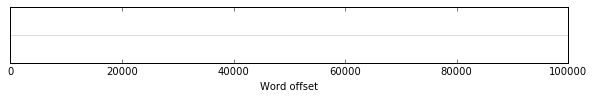

Where if, say, the text is 100,000 words long, then the 50,000th word would sit on the 50% mark on the axis:

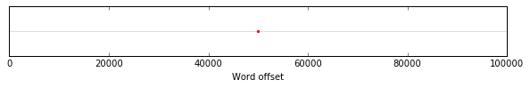

Or, all of the words at once, which blur together into a solid line:

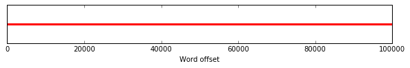

This is the raw, encountered data of the text, the straight line, the flat surface. But, instead of plotting everything, we can also just look at the positions of any individual word in the text. For example, here's the word "death" in *Moby Dick*:

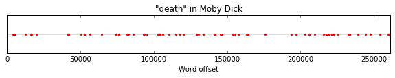

Just eyeballing this we can get a rough sense of how the word distributes inside of this individual text. But, the signal is weak, volatile, undersampled -- there isn't enough data here to say anything with confidence about the general tendency of the word. What we can do, though, is merge together this information from larger collection of texts, where each provides a set of weights across novel time for a given word. For example, here's "death" in a set of 100 other randomly-selected novels, this time with the X-axis mapped onto a standardized 0-1 scale, which makes it possible to compare novels of different lengths:

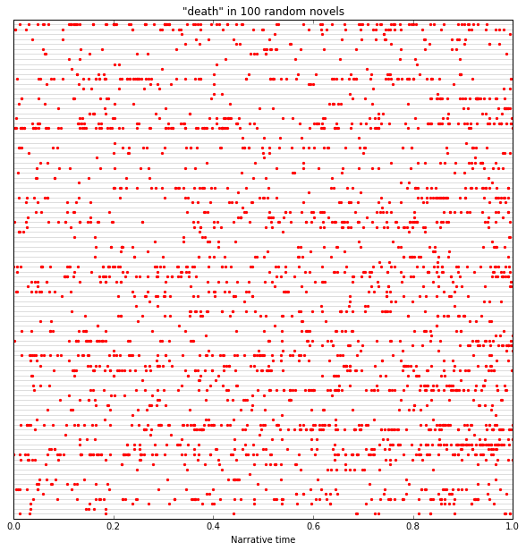

We can't just "add" these up directly, though, since different texts are almost never the exact same lengths, which means that the precise 0-1 offset values will be slightly different, even when instances of the word fall in very similar regions in the texts. To get around this, we can just split up the X-axis into 100 equally sized segments, each representing one percentile of narrative time. For example, for *Moby Dick*:

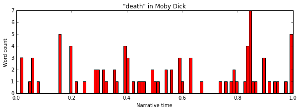

And now, once they ticks bucketed together, we can just add up the counts of "death" in each percentile across all texts and get a combined distribution for all 100 texts:

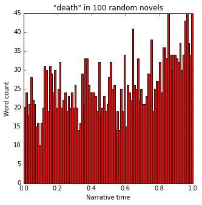

Now, we start to get a higher-fidelity version of the signal, which is what we'd expect -- death tends to be an ending word. Or, beyond just 100 texts, we can do this for all of the Literary Lab's American novel corpus, ~30,000 texts from the Gail American Fiction corpus and the Chicago TextLab corpus ranging from ~1820 to 2000, this time plotted as a time-series curve across the narrative interval:

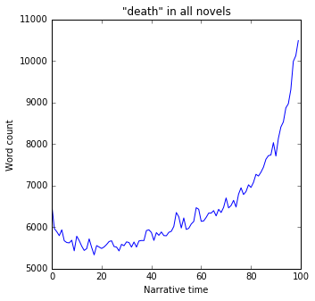

The really powerful thing about this, though, is that it makes it possible to tease out the hidden distributions of words that are so infrequent that they would rarely, if ever, show up enough times to see any kind of trend in an individual text. "Death" is a frequent enough word that we can, it turns out, get a pretty good sense of its distribution just by looking at a handful of texts, and presumably we could pick up on this if we just read them directly with this question in mind -- there's enough data there to start to reason in a kind of anecdotal statistical way about how the word sloshes around inside the narrative interval. But for most words this isn't the case. By Zipf's Law, most words will only show up 1-2 times in any individual text,which gives nowhere close to enough statistical power to make any inferences about its general narratological structure. For example, here's "graceful" in *Moby Dick*:

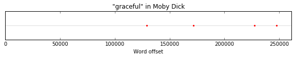

And, in 10 other novels:

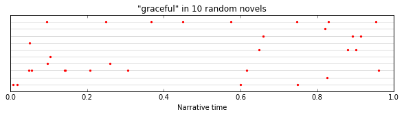

It's showing up just 1-2 times, if at all, and, glancing at these, looks basically random. But, when we merge together this data across the entire corpus, we can immediately see a strong pattern:

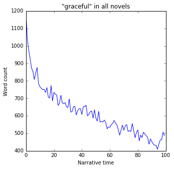

Far from being random, "graceful" concentrates strongly at the beginnings of novels. (We'll circle back shortly to why this is.) This provides an interesting epistemological power -- we are using lots of texts to surface information about the general distributional tendency of "graceful," something that probably *doesn't actually instantiate in any individual text*. To borrow from the language of Bayesian statistics -- we are teasing out information about the "prior" that governs the distribution of "graceful" across the text -- there is a kind of narratological energy that makes it most likely that "graceful" will show up at the very beginning of any given text, even though there are few if any cases where either the author or reader would be aware of this as a deliberate literary decision.

So -- we can start to reason about these narratological tendencies of words, the regions of "novel time" in which they tend to concentrate when averaged out across large numbers of texts. But, where do we go from here? We can just start spot checking individual words that seem interesting, but, if we want to avoid any kind of bias or preconception about what might be most important, what we really want is some way to systematically search through all of the words in the corpus and pick out the ones that have the most irregular or anomalous distributions, the words that do the most narratological *work*.

Before we can do this, though -- before we can compare this notion of irregularity across words -- we first need to be more specific about what it means to say that any given word's distribution is "irregular." We can glance at the plot for death and notice that it seems clearly lopsided, but how do we formalize this? This is an important question to ask, because, in the same way that most words in an individual text only appear a handful of times, a great many words will only appear a small number of times in the entire corpus, and, even when we stack up 30k texts, the combined distributions will still be extremely undersampled. For instance, take a word like "theoretical", which only shows up 3,166 times in the entire corpus:

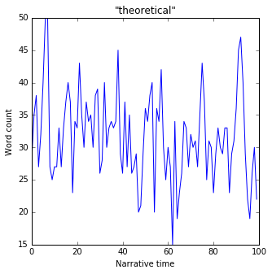

If you squint at this, there might be some kind of downward trend? But, how do we know if this is significant, or just noise in the data? We need to be able to compare this against some kind of null hypothesis, see if the observed trend for a word differs significantly from what we'd expect to see if there were no effect. In this case, this null hypothesis is simply that there is *no relationship between the frequency of a word and the position in the text*. So, in other words, if a word appears a total of 1000 times in the text, we would expect that it would show up exactly 10 times in each of the 100 percentiles in the text. For "theoretical," we'd expect about 32 times per percentile:

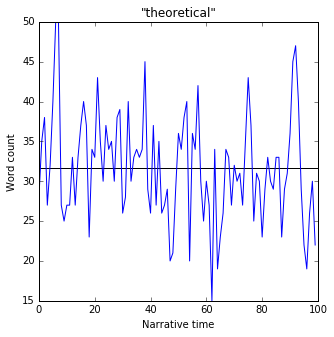

Where the blue line is the expected value, if there were no effect, and the green line is the observed data. So, at some points, the actual counts are higher than expected, and at other points lower. But how much above or below does the observed series need to be in order for it to be significant? There's a closer-form formula that we could use to calculate this, but it's also possible to directly simulate the expected error, which in many ways is more intuitive. We can treat the flat line -- the expected distribution -- as a multinomial probability distribution, and then take random samples from this distribution, which will give us examples of the kind of real-world data we would expect to see if there was no significant trend. For example, here's one random sample:

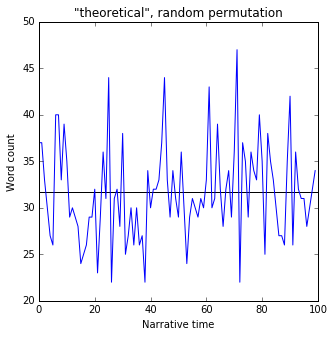

Already, we can see that this doesn't look too different from the observed values in the corpus. To formalize this, we can "permute" the baseline distribution -- draw from it, say, 1000 times. For each of the 100 percentiles, this gives us 1000 values that were produced from the random sampling. From these, we can then compute a simple standard deviation, and then use this to define a "band" around the expected flat distribution that marks the boundary beyond which an observed point would be considered statistically significant. For example, here's the two standard deviation band, which means that if an observed point falls above or below this, there's a ~95% chance that it's not just a random fluctuation -- that the word is significantly over or underrepresented at that position in the text:

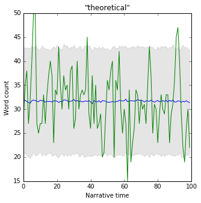

So, in this case, with the low-frequency word, we can see that the actual curve almost always falls inside of the 2 standard deviation band, meaning that we can't say with much confidence that there's any general relationship between the position in the text and the frequency of the word -- either the word doesn't have any kind of chronological anchoring in the text, or we just don't have enough data to be able to say. But, if we turn back to "death," and do the same thing:

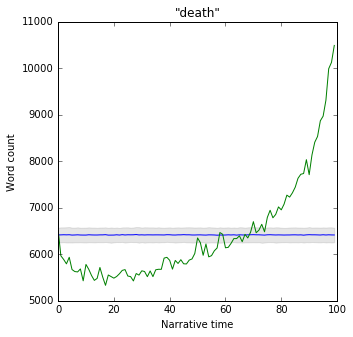

We can see that "death" is far above the expected value at the end of the text -- precisely, 51.6 standard deviations -- meaning we can say with enormous statistical confidence that death is concentrating at the ends of novels. Now, with this in hand, the last step is to find some way of converting this into a single score that captures the degree to which a word is irregular, and in a way that can be compared across words. There are a couple ways to do this, but one simple way is to just take the average number of standard deviations away from the expected value for each of the 100 percentiles -- the average of the zscores in each bucket. This will give high scores for words that have the most lopsided "trends" across the text. For example, for "death," the average zscore is 10.03, whereas for "theoretical" it's just 0.95.

With this in hand, we can now turn back to the question of how to inductively pick out the words that are the most irregular -- words that provide a kind of narratological scaffolding across thousands of novels. To do this, we can just step through each word in the dictionary, compute this metric, and then sort on the values. Here are the XX most irregular words:

[XX most irregular]

There's lots to look at here, but, as a gut check on the method, though, we can immediately see groups of words that map onto intuitive notions about various types of narrative unities, in the classical sense -- narrative as a life, a day, a courtship, etc. For example, words about youth and childhood peak at the very beginning, and then fall off across the rest of the text:

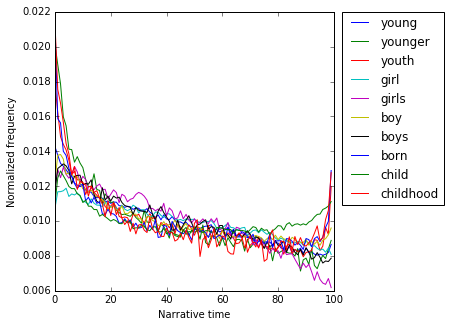

Likewise with words about education:

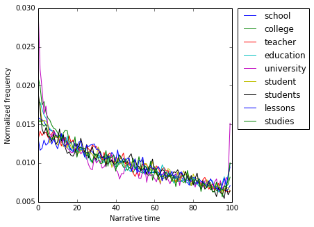

And, in the same vein, words about family life:

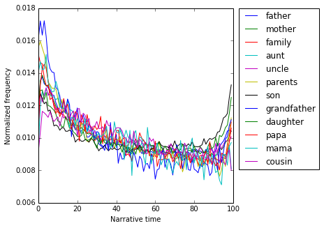

We can also see a concentration of words used to describe people at the beginning, which also makes sense -- at the beginning characters are introduced, the stage is set, the fictive world is getting narrated into existence:

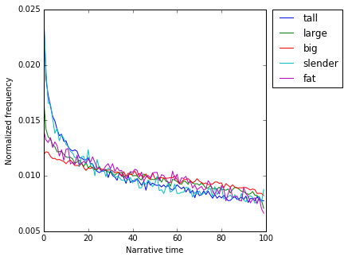

Body parts, meanwhile, are interestingly spit between beginnings and ends. We can make out an interesting distinction between body parts that are used to describe people ("hair" and "nose"), which spike at the beginning, and body parts that are associated with displays of emotion, which peak at the end ("arms" getting thrown around people, the taking of "hands"). And "eyes" and "face," which seem to be associated both with description and emotion:

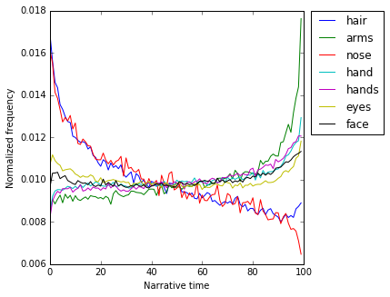

Or, along the same lines, a set of words related to fashion and (mostly good) appearance:

In a more general sense -- *colors* show up at the beginning, also used in obvious ways in the process of painting in the fictive scene:

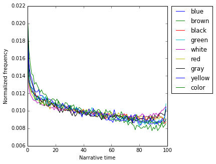

And, at the end? First and foremost, words related to death, particularly involving guns, many of which seem to peak just before the end at what looks like a "climax" or some sort, which seems to occur right around 95%:

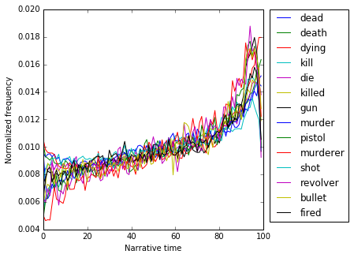

Related, words about criminal justice -- the trial, broadly writ -- not unlike the topics that Ben Schmidt identified in the TV cop dramas:

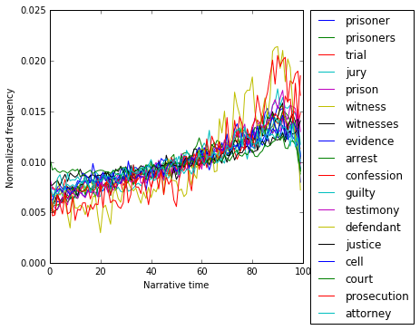

Meanwhile, perhaps the flipside of ending-as-death, the marriage plot:

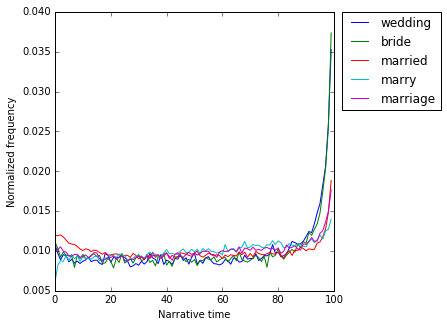

And, along these lines but in a more general sense, a group of words that orbit around notions of resolution -- in which enemies are reconciled, lovers united and reunited, sins forgiven, loose ends tied up, narrative tension discharged, the plot moved into its final pose:

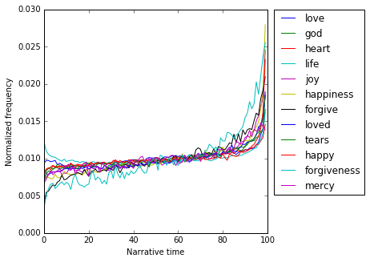

So, this all looks about right -- beginnings tend to be about childhood, family, education, and the introduction of people, places, and things; endings are about death, trials, weddings, reconciliation, forgiveness, various flavors of living happily ever after. Not many of these signals about narrative content are surprising -- but this is useful as a confirmation that the method is effective, a gut check that we're picking up on literary signals that jibe with real reading experiences.

Much more interesting on this list, though, is the presence of a collection of very high frequency words that, it turns out, also have extremely skewed distributions across narrative time. For example, take the word "a" -- the indefinite article -- which comes out as *the* most statistically irregular word in the entire dictionary. The distribution of "a" has a highly symmetrical, almost mathematical structure that looks sort of like an inverse logit function -- it begins high, falls off very quickly, declines more gradually through the middle of the text, and then falls off sharply at the end, mirroring the drop at the beginning:

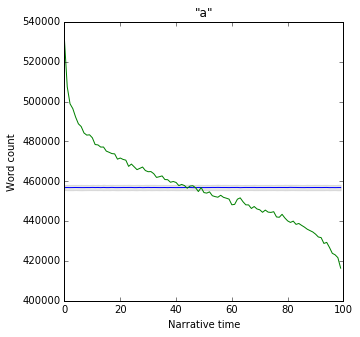

What to make of this? This is an interesting case where it's not actually very useful to check intuitions about this by dipping back down into individual passages in the corpus, since a word like "a" is so common that it will show up in a huge range of contexts, which makes it hard to reason about in the abstract. But, just considered grammatically, "a" -- the indefinite article -- is generally used when a noun is introduced for the first time, when an object makes its first appearance in some narrative context. For example, you might say -- "a man was walking down the street" -- but then, after that, you would switch to the definite article, "the" -- "the man walked into a shop," etc. So, with this in mind -- and with the caveat that this drifts somewhat into speculation, and that it would take more work to back this up empirically -- the obvious interpretation is to think of this graph as a kind of statistical x-ray of the *rate at which newness is introduced into the text*. At the beginning, this is very high, as the fictive world is painted into existence, people and places are introduced, the pieces of the narrative are put into place. It then falls off rapidly after the beginning once the stage is set and the plot starts to spool out, as the fictive matter introduced at the start -- people, places, objects scenes -- shifts into the register of the definite "the," once they have been narrated into existence on the narrative stage. Then, over the course of the middle of the text, the plot continues to move into new fictional space -- new people, new places, new objects -- but more slowly than at the beginning, which has to essentially bootstrap the entire fictional world into existence from the ground up. And finally, at the end, this rate of movement falls off quickly -- as if the text arrives at its ending position a bit early, rapidly stops moving into new fictive territory around the 95% mark. "A," in other words, gives an empirical signal for the "speed" of the novel, in one sense of the idea -- the degree to which it is moving into fictive contexts that have to be introduced for the first time, or to which it is staying put inside contexts that have already been painted into existence by the preceding narrative.

But, beyond the interpretation of any one word -- what's really most interesting here from a theoretical standpoint is that there's any effect, that "a" shows any kind of narratological tendency across the text when considered across tens of thousands of novels. "A" is purely a function word, the 6th most common word in the English language, and bears no semantic content. And again, remember that the null hypothesis here is that we would just see a flat line, that there would be no relationship between the frequency of the word and the position in the narrative. But, not only is there a relationship, but there's a spectacularly powerful one, in fact the most significant of any word in the dictionary -- in this corpus of 30,000 novels, in the first percentile of the text, "a" shows up almost 80,000 times more than we would expect under the null hypothesis, which corresponds to a zscore of XX, where anything above 2 is considered significant.

This becomes much more interesting. Unlike the more semantically loaded signals -- youth, death, marriage -- this starts to feel like a kind of keyhole view into some sort of sub-semantic narratological architecture. But, it's not clear exactly what we should make of this. Does it make sense to think of this as just a lower level version of the types of constraints enforced by, say, genre conventions like the marriage plot, which push "marriage" to the end? Or does that overestimate the importance of literary convention, at this level -- is there some sense in which this trend is *inevitable*, that this must be the case, that it would be nearly impossible to write a narrative that doesn't show this pattern? As far as "a" is concerned -- is a novel like a ball placed at the top of a steep, smooth incline, where it would take some kind of huge structural exertion not to roll down the slope, not to show this symmetrical falloff in the frequency of the word? (This raises the tantalizing empirical question -- are there any texts that invert this, in which "a" *increases* monotonically across the text -- texts that roll uphill?)

Or, to take another example -- if "a," the indefinite article, shows this monotonically decreasing pattern, we might expect the definite article -- "the" -- to do the opposite, to consistently increase across the text -- as more and more fictive material is sketched into existence across the text, "the" becomes increasingly necessary to denote objects that have already been introduced? In fact, though, "the" -- the fourth most irregular word on the list -- looks like this:

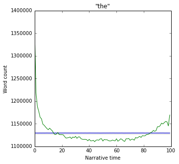

A huge spike at the beginning that falls off very quickly in the first 10% of the text, stays low through the middle, and then spikes back up at the end, though less dramatically than at the beginning. So, "a" and "the" -- flip sides of the same coin, grammatically speaking -- seem to do conceptually different work at a narratological level. Both seem to mark beginnings and ends, but in different ways. "A" shows something about how they are different -- the beginning is a deluge of newness as the fictive world is introduced, a fast start out of the gates, and the end is slow, stationary, in the sense that it has stopped moving into new fictive territory and occupies the fictive space already created across the beginning and middle. But, "the" spikes at both the beginning and the end, and seems to show something about how they are similar, a way in which the end is some kind of return to the beginning.

But, in what sense? What does "the" mark, at a literary register? Again, any one of these questions could be taken up as a project in its own right, but, it's easy to speculate -- perhaps one way to think about beginnings and endings is that they both have to concern themselves with specific, concrete things? This fits with the idea that the beginning has to essentially hammer together the "stage" of the narrative -- the room, the house, the table, the chair, the street, the train, the material platform on which the plot plays out. And, the end? There's an intuitive sense in which the end seems to return to this "surface" of the fictive world, though it's a bit harder to put a finger on what the gist of this is. One way to think about it, I guess, is just to say that things happen at the end -- pistols are fired, people are killed, lovers are reunited, the bride walks down the aisle, etc. The action of the narrative crescendos, the pieces of the plot are moved into their final positions -- Robert Jordan blows the bridge; Ralph dies and Isabel goes back to England, only then to return to Osmond in Italy; Lucy and George marry and go back to Florence. We can imagine, if a novel is turned into a screenplay, that the beginnings and ends have the largest amount of "description" in the text of the script, the prose narration that the screenwriter threads in between the lines, the rough sketch of what would appear on the screen but not in the dialogue -- the layout of the set, the physical movements of the characters, the broad strokes of the photography. Beginnings and ends are preoccupied with narrative *stagecraft*, which pulls the narrative out into a register of description, physicality, specificity, concreteness, *particularity* -- the domain of "the."

Indeed, though it would take lots of analytical and interpretive work to really tease out the mechanics of this in any detail, we can start to triangulate onto this sort of account by looking at looking at the combined trends of much larger cohorts of words in the dictionary. For example, to hook onto the extent to which the text is being *descriptive* -- we can merge together all words that get tagged as adjectives by a part-of-speech tagger, all words that are modifying nouns. As with "the," we see a large spike at the beginning, and a smaller (though still statistically enormous) rise at the end:

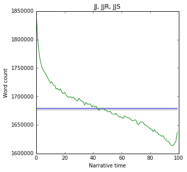

And also for nouns:

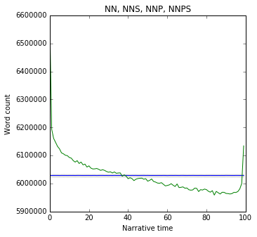

So, beginnings and ends are filled with objects and descriptions, particulars, marked by "the" -- but "a" is only needed at the beginning, when the fictive matter of the text is first being narrated into existence. But, this really just scratches the surface -- there are many more questions than answers here. If narratives begin and end on the physical "surface" of things, the description of objects -- then what sits "below" this surface, outside the beginning and the end, in the middle? To pick up a variation of the question posed by Levine and Ortiz-Robles in *Narrative Middles* -- if we can say that beginnings and ends are concrete, physical, or external, then how do we interpret the *absence* of this signal across the middle of the text? A narrative middle that's non-concrete, non-physical, non-material, somehow internal and abstract? What is this, exactly? Instead of just saying what this isn't, what *is* this middle, in a positive sense? What is the narratological negation of the physical description of the beginning, or the the activity and climax of the end? Maybe -- some sort of psychological interiority? Or, to pick up with the screenwriting analogy -- maybe dialogue, interactions between characters? Indeed, the quotation mark -- a good if not completely foolproof proxy for dialogism, the degree to which characters are speaking to each other -- is an almost perfect inverse of "the" -- very low at the beginning, high through the middle of the text, and then falling off at the end, though not as strongly as at the beginning:

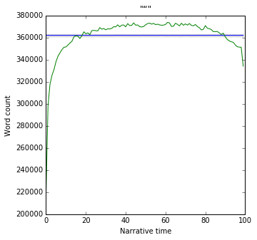

Likewise with "said":

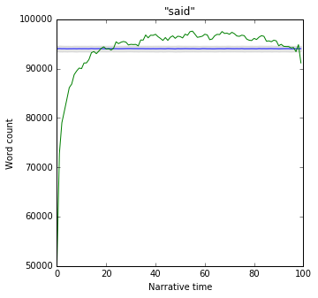

And, perhaps the flip side of "said" -- "think":

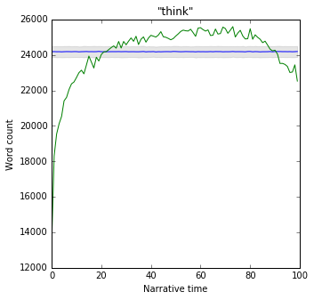

This looks about right, really, though it's interesting to see it shake out of the data so organically. In the most schematic sense, then, can we say that -- novels begin with description, pass through a middle filled with speaking and thinking, and then circle back to description at the end? The center of the novel is human discourse -- inter-personal (speech) and intra-personal (thought) -- bookended by physical description and action?

Other things are more mysterious. For example, it appears that gender, in some sense, has distributional patterns across narrative time. What should be made, for instance, of the fact that "her" is basically flat across the novel, but then spikes suddenly at the end:

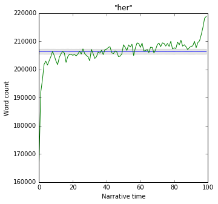

Whereas "him" rises linearly across the text, and then craters in the last 5%?

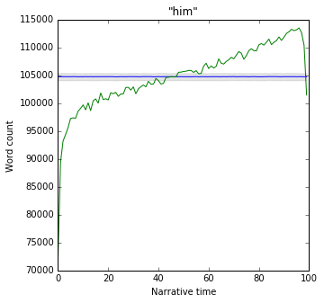

Or that "and" and "or" should behave so differently at the end?

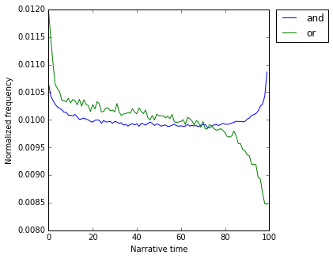

Or any of the other high-frequency stopwords that show irregular patterns -- I, you, of, me, to, will, we, what, do, etc? Each of these feels like a loose thread that might be tugged at, one little strand in a larger matrix of energies that clearly act on narratives in very powerful and fundamental ways, but in ways that fly below the conscious experience of writing or reading. But, the full shape of this, and how it all fits together -- are questions for another time.

## 3

So -- a way to "image" the narratological structure of individual words and then probe through the dictionary and pick out the words that provide the most narratological structure, that deviate most significantly from the expected flat line. We can inductively identify the most narratologically salient threads in the fabric of the text, which seem to come in two varieties -- a layer of subject matter words that more or less map onto expectations about genre conventions and traditional notions of unity in narrative -- youth, school, family at the beginning; death, trials, reconciliations, and weddings at the end -- and a less perceptible, sub-structural layer that plays out at the level of function words and parts of speech, which seems provide a glimpse onto what might be thought of as the underlying "physics" of narrative chronology, operating below the layer of plot of subject matter, like the steel frame of a building -- always there, always doing work, but invisible from the inside, hidden behind the walls.

So far, though, we've followed in the footsteps of previous studies in treading the corpus as completely synchronic information. The process of picking out irregular words operates on a static slice of texts -- to build up the composite distributions for each word, we have to add up counts extracted from each individual text, which necessarily involves collapsing any kind of difference across historical time or cultural context. And, so far, this slice has been the entire corpus -- all 30,000 texts, stacked on top of each other, like sandwiched negatives. To turn back to our original theoretical objectives -- how can we "three-dimensionalize" this data, cast it along a third axis of historical context, turn our attention "once more to the plurality of narrative acts, to their historical, geographical, and cultural diversity"?

We can start to reason about this in a simple, anecdotal way just by splitting up the texts into a series of sub-corpora, broken out by the year of publication, and then constructing these trends for words across novel time in each of these time-sliced segments. For example, to pick back up on "a" -- if we take the corpus and break it up into a set of eight 20-year segments, starting in 1840 and ending in 2000, we can build up eight different time series for "a," one for each of these sub-corpora, and then plot them side-by-side:

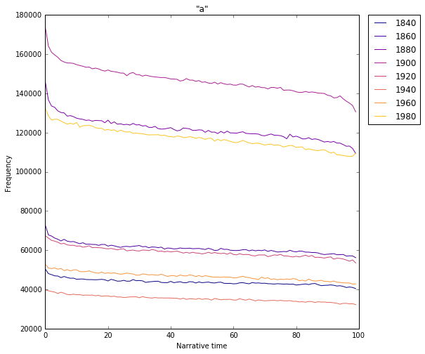

The curves don't line up vertically on the Y-axis because "a" appears a different number of total times in each of the sub-corpora, since each has a different number of novels (eg, we have more from 1900 than 2000) and because the relative frequency of any given word can shift over time -- the kind of diachronic changes in overall volume that get surfaced by something like the Google ngram viewer.

But, in our case, we don't care about changes in total volume -- we just care about changes in the trends of the words across novel time, the "shapes" of the distributions along the X-axis. To get a better sense of this, we can flatten out the differences in total volume by relativizing the curves -- dividing the count in each percentile by the total number of times that the word appears in the time slice, which produces a density function, meaning that the counts will all add up to exactly 1. This has the effect of moving everything onto the same scale on the Y-axis, which makes it easier to look at the changes in the trend. For "a," we can see that the distributions stay more or less the same over time, perhaps becoming a bit "steeper" through the middle over the course of the 20th century:

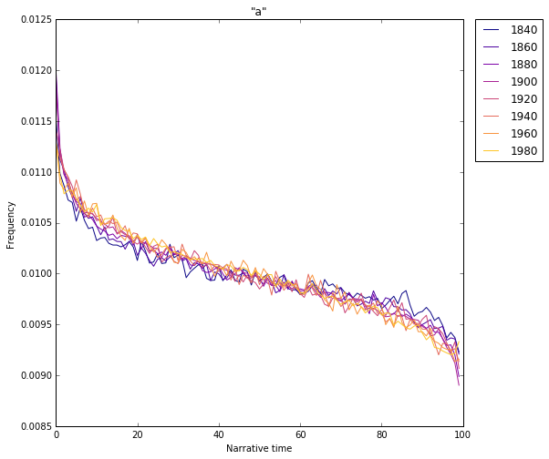

But, in other cases, this very much isn't the case. For example, take a word like "marriage" -- here's the unsliced series across novel time, pulled from all 30,000 texts:

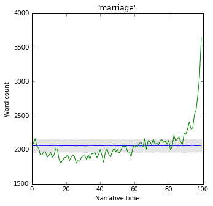

A big spike at the end, and also a smaller peak at the beginning of the text. But, when we split this out into the 20-year slices, we can see that this concentration at the beginning is coming almost exclusively from the time slices towards the end of the corpus, and that the spike at the end is coming from the slices at the beginning of the corpus:

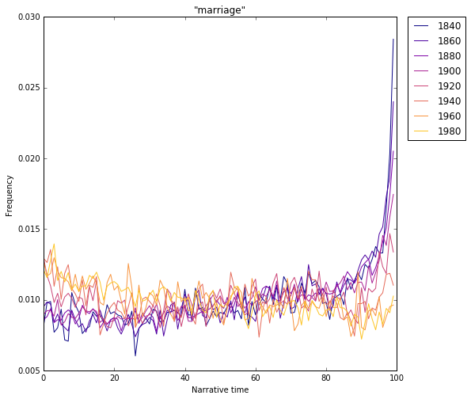

To cut through some of the noise, let's just look at the earliest and latest slices. Here's 1840-1860 in blue, and 1980-2000 in green:

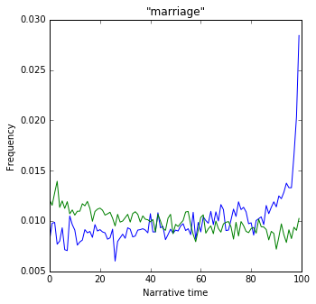

So, far from concentrating in both the beginning and the end, marriage essentially switches narratological sides. In the middle of the 19th century marriage is relatively infrequent at the start of the the text, rises slowly across the first 90%, and then spikes enormously in the last 10%, the resolution of the marriage plot. Whereas, in 1980, marriage begins narratives more than it ends them -- it is relatively frequent at the very beginning and declines slowly and consistently across the text, maybe still ticking up slightly at the end, though nothing like the huge spike in the 19th century.

Marriage *migrates* across the narrative interval, it sloshes from the end to the beginning -- the post-war novel increasingly begins with marriage, the novel becomes preoccupied with marriage itself, and less the courtship that leads up to it. This gives access to the kind of historicized or "three-dimensional" formalism that we talked about at the beginning. In this case -- the X-axis is novel time, the space between the beginning and end of each individual text; the Y-axis represents the degree to which any individual word concentrates in the regions of the text swept out by the X-axis; and the Z-axis is historical time, the transformation of the distributions across literary history. We can literally plot this in three dimensions, and watch the shape of the word mutate over time:

[marriage, 1840-2000, 3d]

But, how do we reason about the size or significance of this change? In the same way that we needed a way to capture the degree to which a word deviates from the expected (flat) distribution inside any given slice of texts -- the score that allowed us to pick out "a" as the most statistically irregular word across the text -- now we need a way to inductively identify the words that move the most significantly over time. Just by eyeballing the plots, it looks like "marriage" moves much more significantly than "a," but how do we formalize this? What moves the most, what are the most significant narratological shifts in the American novel since 1840?

This turns out to be a somewhat tricky statistical question, mainly because of the large differences that we often see in the overall volume across the different time slices -- for example, "marriage" shows up about XX times more in XXXX than in XXXX. This means, essentially, that, for any given word, the distributions in different time periods will have different levels of statistical power, which makes it hard to compare them directly. We need some way to measure the degree to which distributions from different historical periods are different, but in a way that factors in the different levels of statistical confidence that we have in the data from each of the slices.

For example, take the word "gun." When we plot out the raw distributions across novel time for the earliest and latest time slices, we can see a really significant change in the trend -- at the end of the 20th century, "gun" spikes massively around the 95% marker, whereas in the middle of the 19th century it's more or less level across the text, maybe with a slight upward trend -- but also that "gun" has a much higher frequency overall in 1980 than in 1840:

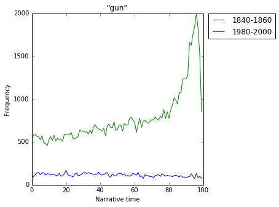

How to compare these? One way to proxy the overall "position" of each of the individual distributions is to compute its center of mass -- if you think of each curve as sweeping out an area above the X-axis, the center of mass is the point on the X-axis at which, if you drew a vertical line, this area below the curve would be split in half:

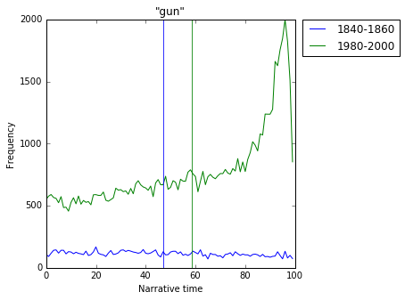

So, in this case, the big spike at the end of the 1980 curve pulls the center of mass to the right, to just shy of the 60% marker, whereas in the 1840 the center of mass is closer to the center, a bit to the left, since the curve is somewhat higher at the beginning. In a simple sense, this gives us a way to capture the extent to which this distributions are different, the degree to which "gun" sloshes to the right over the course of the 20th century -- we can just take the distance between the two lines on the X-axis, in this case about 10 percentiles. But again, the problem is that we're less confident in the 1840 slice, since there's so much less data. The curve looks undersampled, volatile -- we can boil out a center of mass from this particular slice of data pulled from our current corpus, but, if we took a different set of novels from a different corpus over the same time range, the center of mass might move somewhat to the left to right, changing out score for the size of the movement between 1840 and 2000.

What we need, then, is a way to formalize this uncertainty about the location of the center of mass. There turns out to be a delightfully simple way to do this -- we can permute each of the curves a large number of times, meaning, we treat the observed values as weightings for a discrete probability distribution and then draw new samples from this distribution, where the size of the samples matches the total word counts for each of the observed distributions. If we do this, say, 1000 times for each, we get a set of 1000 permuted versions of the raw distributions:

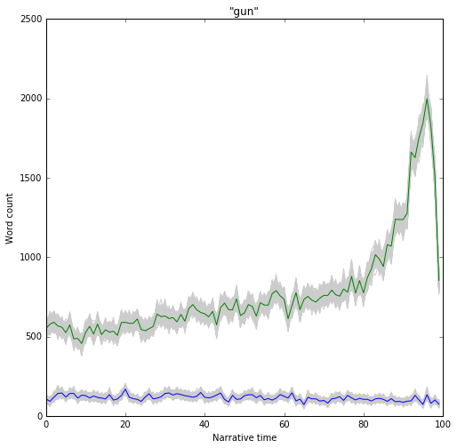

And then, for each of these permutations, we can compute a new center of mass, each of which will be sightly different. This gives us, essentially, a distribution of the centers of mass for each of the time slices that captures the degree to which we can trust the location of the center of mass. For example, for "gun," the set of permuted centers of mass for the 1840-1860 spread out over a larger portion of the X-axis than those for the 1980-2000 slice:

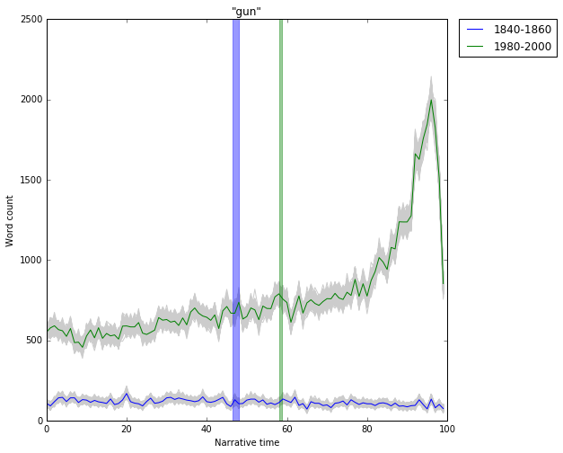

What we have, then, is two distributions with different means (different "centers" on the X-axis) and different variances (different "spreads" on the X-axis), and we want to boil out a single metric that captures the extent to which the two distributions are different, the degree to which the word has moved or migrated. To do this, we can turn to a well-established family of what are called "effect size" metrics, which are designed for exactly this situation. Specifically, we can use the cohens-d metric to measure an adjusted distance between the distributions, in a way that factors in the "pooled standard deviation" of the two distributions, the extent to which we are uncertain about each of the centers of mass. So, for "gun," the cohens-d between the two center of mass distributions is ~54, whereas for "a" it is ~30 -- "gun" *moves* more over time than "a."

With this in hand, we can now probe through the dictionary again and inductively pick out the words that move most significantly, that are the most *narratologically unstable* over time, and then try to use these words as signposts that point to large-scale changes in narrative structure over the last 150 years. Here are the XX words with the largest movements:

[top XX cohens-ds]

Again, it's far beyond the scope of this essay to look at this comprehensively, but some threads immediately pop out. Marriage comes in as the 11th most "migratory" word, and other related words are nearby:

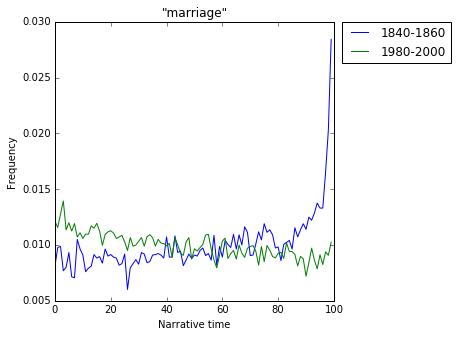
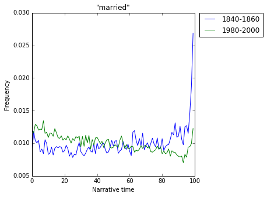

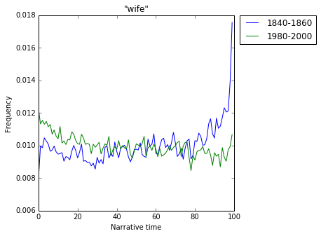

All of these follow the same pattern -- in 1840 they spike at the end, the conclusion of the marriage plot; but, by 1980, they have shifted to the left, and concentrate at the beginning. Or, take "friends," another word about the coming together of people, in a sense, and presumably marking the resolution of some kind of narrative tension that complicates the path to friendship / marriage:

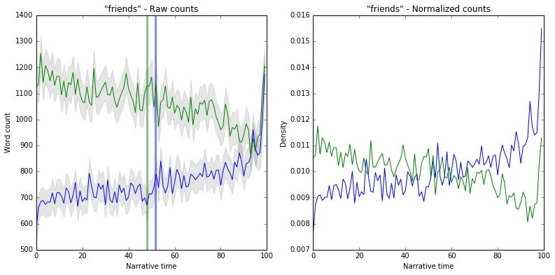

And likewise with "death":

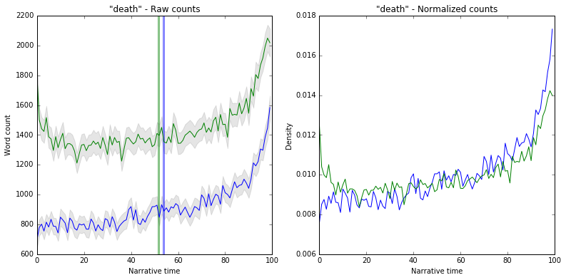

Again, a spike at the end, as we would expect, but, by 1980, we can see that it also develops a pronounced concentration at the very beginning -- in addition to ending with death, novels begin with it, death becomes a starting point, an initial even that sets the plot into motion, what Brooks might call the "irritation" into narrative. It provides the energy that opens up the interval of narrative, not just the ("death"-like, literally in this case) closure that seals off the narrative at the end.

Marriage, friendship, death -- all shift from the end towards the beginning, become semantic signals at the start of the text, not just the end. It seems then, in a general sense, as if the post-war American novel is migrating into spaces that, in the past, marked the *boundaries* of *terminuses* of narrative. Narrative ends slosh backwards across the text and turn into narrative beginnings. The postwar novel spills over the edges of narratives from the 19th century, it moves into what was previously the post-narrative space -- marriage itself, not just courtship; friendship itself, not just the making of friends; the aftermath of death, not just the life that came before it.

## 4

Indeed, when we look closer, we can make out another dynamic along the same lines that seems to play out at an even lower and more fundamental level, at a register that, once again, appears to sit below any kind of surface-level genre convention. Here is the movement between 1840 and 2000 of the word "had," which shows the second most significant movement of any word in the dictionary. In the middle of the 19th century, "had" was more or less flat across the text, rising slowly to a peak near the end. By the end of the 20th century, though, it has shifted enormously towards the beginning of the text -- it is highest at the very beginning, falling off quickly over the first half of the narrative:

Now, at a grammatical level, "had" is two things -- it is the past tense of "to have," but, much more frequently, it forms the past perfect tense, which we can think of as the past tense within the past tense, used to describe things that, at some point in the past, *had* already been finished, completed, perfected -- "had lived," "had worked," "had thought," etc. Or, as part of the past perfect progressive, with "been," to make actions that had been taking place at some point in the past -- "had been living in ...," "had been working at ...," "had been thinking about ...," and so on and so forth. Indeed, with "been," we see the same movement:

What's happening here? Essentially, at the beginning of the text, the 20th century narrative is reaching backwards into the pre-narrative space -- instead of charging directly forward out of the gates into the narrative interval of the story, the syuzhet begins by first swiveling around and looking backwards into what came before the fabula. The beginning, in a sense, becomes what came before the beginning, the pre-beginning, the beginning of the beginning.

[had quotes]

Likewise, we can see a cohort of words related to temporality and duration that show the same pattern -- that move leftwards over the course of the 20th century, that migrate to the beginning:

The beginning is looking backwards into the "weeks" and "months" that preceded it. In the opening shot the temporal "camera" of the narrative is facing backwards, away from the contents of the interval that actually "belongs" to the narrative, that is enclosed by the text. The beginning is in the past tense relative to itself, situating itself in the context of what came before, casting backwards into the prehistory of narrative.

And, at the end of the text? The opposite happens. At the end of the 20th century, "will" -- the future tense -- spikes massively at the very *end* of the text:

 If the beginning is increasingly looking back into the pre-narrative space, then ends are looking *forward into the post-narrative space*, towards what will come after the terminus of the narrative. The ending becomes less of an ending and more of a threshold of transition, a second beginning, the narrator and characters gazing past the fabula of the present narrative and into the future.

[will quotes]

## 5

So, over the course of the 20th century, and especially since 1945, the edges of the American novel become permeable, porous, leaky -- the beginning starts to look back at what comes before the beginning, and the end looks forward to what will come next. It is as if the narrative, in a sense, becomes a *sub*-narrative, embedded inside of an implied larger narrative that surrounds it on either side. What's striking about this, though, is that it seems to represent, in a sense, a fascinating literary-historical disproof or unravelling of the theoretical understanding of beginnings and ends that was being developed across the start and middle of the 20th century -- in fact, over more or less the exact same period during which we can see this tectonic change in the actual structures of beginnings and ends changing in the American novel. We're immediately reminded, in a sense, of the extent to which this *doesn't* correspond to the predominant theorization of the chronology of the narrative that was developed by theorists like Brooks, Kermode, Sartre, Benjamin, and James -- the idea that beginnings and ends are useful to the extent that they provide an enclosure, a circle, a "fiction of concord" around around the fabula of the text -- beginnings and ends as *births* and *deaths*, bright red lines of demarcation that are useful precisely to the extent to which they aren't permeable, aren't porous, aren't leaky.

The most concise statement of this is probably Peter Brooks' 1977 essay *Freud's Masterplot*, in which Brooks takes Freud's account of "Thanatos" as described in *Beyond the Pleasure Principle* -- an impulse to repetition and return, which is ultimately a desire to return to the psychological stillness and discharge of the state before life, death -- and uses this as a structural metaphor for narrative, which, in the same way, becomes a kind of repeating arabesque that moves in the direction of a death-like ending. The beginning is a structural birth:

> For plot starts (must give the illusion of starting) from that moment at which story, or "life," is stimulated from quiescence into a state of narratability, into a tension, a kind of irritation, which demands narration. Any reflection on novelistic beginnings shows the beginning as an awakening, an arousal, the birth of an appetency, ambition, desire or intention.

And the middle:

> The ensuing narrative -- the Aristotelean "middle" -- is maintained in a state of tension, as a prolonged deviance from the quiescence of the "normal" -- which is to say, the unnarratable -- until it reaches the terminal quiescence of the end.

The narrative interval, then, is surrounded on both ends by a quiescence that is unnarratable, that maps onto a kind of total negation of the "state of narratability," the "life" represented by the text itself. And meanwhile, the death-like ending provides the full stop, the moment of complete closure, that binds the metonymic unfolding of the chronological text into a unified edifice of metaphorical meaning:

> All narration is obituary in that life acquires definable meaning only at, and through, death. In an independent but convergent argument, Walter Benjamin has claimed that life assumes transmissible form only at the moment of death. For Benjamin, this death is the very "authority" of narrative: we seek in fictions the knowledge of death, which in our own lives is denied to us.

The curtain drops, the narrative concludes, dies, and it is only in this moment of total closure and discharge that what Kermode calls the "successive" structure of the narrative congeals into a sense of unity and meaning -- the ending seals off the text, closes it out, converts the metonymic chaos of the chronological experience into metaphorical unity, provides a structural enclosure for meaning that is denied to the reader in actual life. Which, unlike the novel, is always experienced en route, in transit, partially, incompletely, in the middle of the successive piling-up of circumstance and experience. In *The Sense of an Ending*, Kermode calls this the experience of life "in the middest":

> Men, like poets, rush 'into the middest', in media res, when they are born; they also die in medis rebus, and to make sense of their span they need fictive concords with origins and ends, such as give meaning to lives and to poems. They fear is, and as far as we can see have always done so; the End is a figure for their own deaths. [...] In the middest, we look for a fullness of time, for beginning, middle, and end in concord.

The novel exists to cast a lasso around some segment of fictive space, to draw two lines in the sane, to wrap up a chunk of thought and experience inside of the structural enclosure that is missing in real life, which tumbles out chaotically and without meaning. Narrative beginnings and ends are *useful* to us, Brooks and Kermode think, to the extent that they enforce this sense of demarcation, the degree to which they can measure off a discrete piece of narrative cloth and cut it cleanly at both sides. They are useful to the extent to which they are not porous, not permeable, not leaky. We turn to narratives to the extent that they are sealed vessels for meaning, like dipping a cup into a stream -- the work of demarcation, of cordoning off some piece of thought or experience, is the fundamental competency of narrative.

Lived experience is a firehose of perception; life tumbles out haphazardly. Trying to make sense of the events of life as they spool out, from within the "middest," is like watching a stock ticker, trying to tell a story about the meaning of the price at any given moment. When it spikes it's impossible to know if it's the beginning of a bull market or a flash in the pan before a fall, when it dips if it's a blip, an aberration, or the beginning of a reversal, the high water mark, time to sell. It is only at the end, after the fact -- looking back on the last year, the last decade, the last century -- that *meaning* emerges, that it becomes possible to interpret or understand the contour of the line. As James puts it, famously:

> Really, universally, relations stop nowhere, and the exquisite problem of the artist is eternally but to draw, by a geometry of his own, the circle within which they shall happily *appear* to do so.

And yet, just as this understanding of beginnings and ends is developing during the beginning and middle of the 20th century, it seems as if the novel is *losing* precisely this sense of enclosedness -- the circle is breaking, blurring, the beginning and end cease to be rigid boundaries, and turn into something much more fluid and partial. They become thin lines in the sand, bent corners on pages of a larger narrative that implicitly surrounds the text, the spaces before and after the edges of the narrative that are looked towards from the beginning and end. Beginnings feel less like birth, ends less like death -- the space before and after the edges of the text is no longer what Brooks thinks of as a space of "quiescence," the nothingness before and after life, the space of the unnarratable -- it is narratable and indeed is narrated, in the sense that the beginning looks back and the end looks forward. The novel becomes more like a vignette, an episode, a novella, a short story, a fragment, a mimetic representation of "life in the middest" and not an escape from it.

This itself, though, is again more of a critical beginning than an end. So the edges of the novel blur out, the membrane becomes permeable, the capsule begins to leak -- and the novel, perhaps, ceases to do the psychological *work* that Brooks, Kermode, Sartre, and Benjamin imagined, if it ever did. But -- why? We can imagine a range of answers to this, ranging from relatively hard-headed historicisms to accounts that play out at a more diffuse intellectual-historical register. Perhaps -- the "program era," as documented by McGurl, led to a rise in the intellectual currency of the short story, easier to workshop in the context of the MFA, and, as writers started to train on this format, the novel starts to echo the vignette quality of shorter fiction, scraps and fragments instead of totalities. Or, in a more general sense -- perhaps we're simply seeing the novel become involved in a kind of feedback loop with the critical theory and general intellectual milieu of the second half of the 20th century, which, to paint a broad stroke, became distrustful of the idea that a narrative might be able to provide a "fiction of concord" or a "unified meaning," or that such a thing would even be desirable.

[Or, to throw critical caution entirely to the wind -- if we indulge Kermode's argument that the beginnings and ends are essentially modern stand-ins for the structure and meaning that was provided historically by eschatology -- the religious expectation of a literal end of history -- then perhaps we can wonder if the approach of the millennium in the second half of the 20th century provided, momentarily, a real and external sense of historical closure and meaning that, for a moment, made it less important for fictional narratives to provide a substitute? If we look just at novels published since 2000, after the millennium -- would we see a reversal of this trend, a swing back in the direction of narrative enclosure -- the past perfect draining out of the beginning, "will" sloshing back away from the ending, a re-sealing of the text?]

Beyond this larger question of why -- there's a meta-critical question of what an answer to this kind of question *should* look like, in a general sense. To take up a question that the Literary Lab is posing in a conference in the spring -- what exactly constitutes a "result" in these types of projects? How do we know where and how to end these lines of inquiry -- on what type of surface should the critical process finally land, at the end of the day? In this case, with this sort of "three-dimensionalized" formalism -- do we end with a historical insight, or a structural insight? It could go in two directions -- we could use the formal changes as a mechanism to say something about the history of the 20th century, the larger cultural milieu around the novel. Or, we could think of the historical axis as a mechanism for better understanding narrative itself -- change over historical time provides a kind of stereoscopic vision onto narrative, a continuously running set of experimental conditions and permutations that provide a triangulation onto the range of forms that the narrative is capable of exhibiting. Do the formal changes tell us something about history, or does historical drift tell us something about form? Is narrative structure a means to the end of understanding history, or vice versa? Which tells us about which? Where do we finally plant the flag -- in the history, or in the form?
