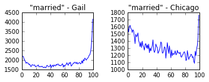
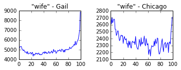
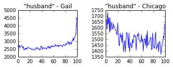
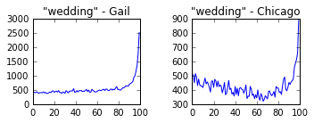

# Storing literary feature data in SQLite

A couple weeks ago I wrote about some of the MPI code we've been running on the campus cluster to chew through data sets that are too big for our laptops. But - what comes after this? Eventually the job finishes, the processes get killed, the SSD drives get wiped, and the "result" - the data that comes out the far end - has to get flushed to disk in one way or another. What's the best way to store this type of output data? In a very pragmatic sense - where do you _put_ it?

In the example from the last post, this was simple - we were just counting up the total number of words in the Extracted Features data from Hathi, so the result was literally just a single integer that can get printed off into the logs at the end of the job. But, in many cases, this feature data can itself be quite large and complex. How to store this, how to warehouse it? Regular text formats like JSON or CSV? Directly serialized data structures like Python's [pickles](https://docs.python.org/3.5/library/pickle.html) or [shelve](https://docs.python.org/3.5/library/shelve.html) files? Key-value stores like [BerkeleyDB](https://en.wikipedia.org/wiki/Berkeley_DB), [Redis](http://redis.io/), [LevelDB](https://github.com/google/leveldb), [Rlite](https://github.com/seppo0010/rlite), [Vedis](https://vedis.symisc.net/)? Scientific formats like [HDF](https://en.wikipedia.org/wiki/Hierarchical_Data_Format), via something like [PyTables](http://www.pytables.org/)? Tabular formats like [Parquet](https://en.wikipedia.org/wiki/Apache_Parquet) or [Avro](https://en.wikipedia.org/wiki/Apache_Avro), from Hadoop-land? Column-based databases like [HBase](https://hbase.apache.org/) or [Cassandra](http://cassandra.apache.org/)? Or just something no-frills like Postgres or MySQL?

At first this seemed like a fairly workaday programming question - as much a matter of taste, as anything - and I bumbled through a few ideas without really thinking hard about it. But, as I kept trying different things - and running up against unexpected and interesting problems - I realized that this was actually one of those little threads that, when pulled on, ends up unravelling into a set of bigger and more engineering-philosophic questions. It's circular, really - the answer to the technological question of "how to store it?" is - well, what kind of data is it in the first place? Sitting at the keyboard, working on some particular project, I always had an answer to this in the moment - it's a single integer; it's a set of word counts, broken out by pages that do and don't contain "literature," etc. But, in the general case, this dissolves into the larger presecriptive question - what kind of data _should_ be coming out of these extraction jobs? Should it be big or small, measured in bytes, kilobytes, megabytes, gigabytes? How should it plug in with the process of analysis and interpretation that eventually bakes off the specific little artifacts - values, figures, tables - that get surfaced in pamphlets or articles? How general-purpose or specific should the data be? Should we write programs that produce very flexible and open-ended sets of features that could be used to answer a number of different questions - the first in a pipeline of steps, a branching tree of analysis that flows into a number of different lines of inquiry - or should the code laser in on one particular question, precipitate out a "finding" in one fell swoop?

To take an example - back in college I wrote most of a senior thesis (before abandoning it for a another topic) on two lines in Hemingway and Dostoevsky in which the act of writing is described, in almost identical terms, as a process of "getting rid of" something, of cutting something undesirable out of the mind. Curious if this might be a point of entry into some more general overlap or affinity, I spent three months reading through basically all of Hemingway and Dostoevsky, trying to find other instances of the same trope. But, really, this lends itself to computation - it's basically a very complex type of "search," in a sense - and I've been thinking recently about taking this back up and seeing if it would be possible to write a program that could automatically identify similar passages, in some kind of fuzzy and flexible way, in lots of texts. But, there are two ways to go about this - you could start with the original, specific question, growing out of an analog reading experience, and write a focused little chunk of code that scans through big stacks of novels and tries to find places where writing is described in exactly this way, as a kind of psychological purging, a sort of Freudian discharge. Or you could ask the question in the more general case - program a little literary-critical radio telescope, as it were, that would sweep out big arcs in the sky and try to "observe" the entire class of metaphors of writing that exist out in the literary universe - when novels talk about novel-writing, when writing becomes about writing - what does this look like, how is it described in the general case? Is this particular analogy for writing widespread of representative, a signal for something larger, or is it just one among thousands of metaphors for writing, a tiny thread in a huge cloth, an accident of Hemingway picking up a Garnett translation Paris in the 20s and channeling a bit of the Underground Man into Robert Jordan? Should we point the telescope at one particular metaphor for writing, or scan the entire sky for _all_ metaphors for writing?

As Mark pointed out to me, it's not that we can escape the work of making hypotheses altogether, and just fall back into a mode of passive data analysis where we collect everything, throw it at the wall, and see what sticks. There has to be some kind of narrowing-down, some process of reduction, or else the "feature sets" would just _be_ the raw corpora themselves, like Borges' map that becomes as big as the world. But how should these hypotheses be "sized" - big or small, diffuse or concrete, general-purpose or specific? Do we begin with specific literary-critical hypotheses and test them directly, quickly, surgically, or do we start with a more diffuse orientation, an interest in a class of questions, and gather up lots of data and let specific lines of inquiry emerge around the salient features that pop out in the process of analysis?

This isn't clear to me, and I think I swing back and forth on it from project to project. Both seem to have risks - start too narrow, and you might miss a more interesting version of the question; start too broad, and you might get lost in a sea of leads and never wrestle things back into contact with literature, as opposed to just language or information in a general sense.

## SQLite

But, to come back to the technical question of where to put the data - in the last few months I've stumbled into an approach that seemed a little weird at first, but which, as I've gotten further along on a couple of projects, I like more and more - just put everything in [SQLite](https://sqlite.org/).

This seemed strange, I think, because of some misconceptions that I had about SQLite from my previous life, when I spent most of my time doing application development instead of scientific / statistical programming. At first blush SQLite can seem sort of like a toy compared to regular databases Postgres or MySQL. There's no server - the entire database is stored in a single flat file, and transactions are implemented with unix file locks, which obviously has implications for concurrency that can be showstoppers for, say, a busy web application that needs to do lots of concurrent writes. In my head it was something you might use in mobile apps or embedded systems, for relatively small amounts of data in constrained environments where a full-service database would be overkill.

In fact, though, far from being a toy, SQLite is actually a remarkably, almost dizzyingly serious piece of software. From an engineering perspective, the codebase has acquired a kind of cult following in recent years, and it widely regarded as one of the most sophisticated and robust open-source projects in existence. The testing harness [weighs in at a mind-boggling 91 _million_ lines of code](https://www.sqlite.org/testing.html), about 800 times larger than the actual application, and covers extreme edge cases that I'd never in a million years think to test - physical power failures, etc. The typing system is a bit eccentric - it's enforced at the level of individual values, not columns, meaning you can store string values in integer columns, for instance - but generally speaking it implements a very complete flavor of the SQL spec. And, far from being limited to small data sets, the database file is happy to grow as large as 140 terabytes, far more than I can ever imagine needing. (The raw data for all of our corpora, by comparison, is just around 5TB.)

And, in fact, many of the things that are often cited as problems or limitations with SQLite actually turn out to be advantages in the context scientific / cluster computing. For example, the fact that it's server-less, just a C program that gets embedded inside of an application, not a separate service that communicates over the network - this means that it can be used in HPC environments where it's difficult or impossible to create daemonized services - it's no different from just dumping data into a pickle or JSON file. And, from a standpoint of research methods, the minimalistic flat-file ethos is really attractive. The file can be put under version control with something like [Git LFS](https://git-lfs.github.com/), uploaded to Dropbox and shared with colleagues, or dropped into an institutional repository. No need to fiddle with deployments or configuration, bake off SQL dumps, etc. - the database and the data are just one-in-the-same. And, because SQLite is so ubiquitous, and bindings exist onto it from essentially all languages - it's not too far outside the the pantheon of canonical unix utilities like grep or awk - it's almost as portable as a text format like JSON or CSV.

# The literary interior

But, by far the biggest advantage is the flexibility that something like SQLite provides during analysis. To take an example - recently I've been writing some code that looks at the the distribution of words inside of a collection of about 30,000 19th and 20th century novels. The idea is to take a systematic look at the internal structure of long narratives - the ways that plot, theme, syntax, and meaning distribute in different regions of texts. There have been a couple of really interesting projects in the last few years that have looked at specific angles onto this. Most well-known is probably Matt Jockers' "[Syuzhet](http://www.matthewjockers.net/2015/02/02/syuzhet/)," which plots the movement of "sentiment" across narrative time; in a recent essay in New Literary History, Andrew Piper builds a [computational model of the conversion narrative](https://muse.jhu.edu/article/581921/pdf), typified by Augustine's _Confessions_ and marked by a semantic swerve near the end, and then uses this signature to find other "conversional" texts; Ben Schmidt looks at the [distribution of topics inside of TV scripts](https://bighumanities.files.wordpress.com/2015/10/s01208_5298.pdf), and was able to tease out a snapshot of the prototypical cop drama, a crime at the beginning and a trial at the end; here in the Lab, the Suspense project is plotting out the movement of suspense and un-suspense across novels, and Holst Katsma looked at [changes in the level of "loudness" across the text](https://litlab.stanford.edu/LiteraryLabPamphlet7.pdf). And, in computational linguistics, there's an older and well-established line of work on this general question (though with a more applied than critical bent), dating back to [Marti Hearst's work on text segmentation](http://people.ischool.berkeley.edu/~hearst/research/text-segmentation.html) in the early 90s.

Building on this - what could be learned by taking a lower-level, sort of "basic science" approach to the question? Instead of starting with a specific phenomenon - sentiment, loudness, suspense - what could be learned just be looking at the distributions of individual words inside of texts, but at a really large and comprehensive scale? How to survey the literary interior, observe it, see what's there? What patterns would emerge? What do beginnings, middles, and ends actually consist of, considered at the scale of many tens or hundreds of thousands of novels? Do these textual "regions" have consistent thematic signatures, or does it all wash out in the aggregate? To take up a question posed recently in a collection of essays called [_Narrative Middles_](https://www.amazon.com/Narrative-Middles-Navigating-Nineteenth-Century-INTERPRETATION/dp/0814252435), edited by Caroline Levine and Mario Ortiz-Robles - what is a "middle," exactly? Is it just a matter of what it's not - not the beginning, not the end, the connective tissue in between - or is it conceptually addressable region in a text, something with a consistent signature across many novels? And, if these narrative regions do instantiate in computationally observable ways - how stable are they over time? Have the archetypal metaphors for narrative structure - a day, a life, a season, a courtship, a marriage - changed over time? Are beginnings, middles, ends, climaxes, denouements different in 1940 than in 1900, or 1860, 1820, etc? What's the _shape_ of narrative, present and past?

Here's the SQLite schema I'm using:

```sql
CREATE TABLE token (
	corpus VARCHAR NOT NULL,
	year INTEGER NOT NULL,
	token VARCHAR NOT NULL,
	pos VARCHAR NOT NULL,
	"offset" INTEGER NOT NULL,
	count INTEGER NOT NULL,
	PRIMARY KEY (corpus, year, token, pos, "offset")
);
```

Where "offset" is a 0-100 integer that represents a percentile along the X-axis inside of the texts. For example, these rows:

```
gail|1900|the|DT|14|136894
gail|1900|the|DT|15|136880
gail|1900|the|DT|16|136213
```

Mean that the word "the" appeared 136,894 times in the Gail American Fiction corpus, in years between 1895 and 1904, as a determiner, and at the 14% marker in narrative time. At the 15% marker, 136,880 times; at 16%, 136,213 times, and so on and so forth.

When this table is indexed with all ~20k novels in the Gail corpus (roughly 1820 - 1920) and another ~10k novels from the 20th century, the counts get broken out into 132,700,715 rows, which SQLite packs into a (fairly) economical 9.2g file. Indexes are left off, by default, to speed up the bulk-insertion that happens during the final step in the extraction pipeline, but, once the table is loaded, indexes can be added to the individual columns to speed up queries:

```sql
CREATE INDEX token_corpus on token(corpus);
CREATE INDEX token_year on token(year);
CREATE INDEX token_token on token(token);
CREATE INDEX token_pos on token(pos);
CREATE INDEX token_offset on token(offset);
```

Now, with the table loaded and indexed, it's trivial to query out time-series trends for any combination of words, years, parts of speech, or corpora. For example, to get a (narrative) time-series for an individual word, in both corpora and across all years, we can just filter on the token, group by offset, and sum up the counts:

```sql
SELECT offset, SUM(count)
FROM token
WHERE token="young"
GROUP BY offset
ORDER BY offset;
```

Just as a gut check on the method, here are the trends for a couple words we'd expect to mark beginnings:


And, ends:


Looks about right. Are these trends consistent between the two corpora, separated by about a century? We can slice them apart just by tacking on another `WHERE` clause:

```sql
-- Offsets for "young," just in Gail:
SELECT offset, SUM(count)
FROM token
WHERE token="young" AND corpus="gail"
GROUP BY offset
ORDER BY offset;

-- And, just in Chicago:
SELECT offset, SUM(count)
FROM token
WHERE token="young" AND corpus="chicago"
GROUP BY offset
ORDER BY offset;
```


Very similar. In other cases, though, there are interesting differences - words related to marriage shift towards the narrative beginning, somewhere in the space between the Gail and Chicago corpora:










So, marriage increasingly becomes the _subject_ of narrative, not just its endpoint. Beyond words like these that have pretty obvious narratological anchorings, though - even function words that don't carry any kind of semantic meaning show really pronounced trends. Here's "the," again broken out for Gail and Chicago:


This starts to edge in a more interesting direction, I think. In a way, it's interesting that there's _any_ effect here, let alone something so significant - the null hypothesis is that everything would wash out into a uniform distribution, a flat line, that there would be no relationship between the frequency of a word and its position in the narrative. But, "the" - the most common word in the language - has a highly irregular trend, with huge statistical significance (the chi-square p-value literally rounds down to 0, when printed out in Python). So - beginnings and ends are "concrete," in some sense, preoccupied with specific, definite objects? This makes sense, I suppose?. At the start - the stage has to be set, the scene filled with props and characters, the fictional world painted into existence and populated with matter; at the end - the action of the text has to climax and resolve, the plot has to move into its final pose, the pieces moved into their endgame positions. Beginnings and ends are preoccupied with narrative _stagecraft_, which, it seems, pulls the narrative register outwards into the external world and pins it onto specific places and things - the chair, the table, the house, the city, the countryside, the car, the train, the gun, the wedding, the deathbed, etc.

Unlike with the more semantically focused words, this also starts to feel like a keyhole view onto some kind of broad narratological skeleton, a set of structural priors baked into the DNA of stories that manifest in consistent ways across narrative time in large numbers of texts. But, as is often the case at this distance, it's epistemologically difficult - what can be said, at a literary register, about the the "boundaries" that seem to get marked off by this? Do the peaks at the beginning and the end mark _the_ beginning and end - does the beginning end at right around the 20% mark, and the end begin right around 65-70%, when it begins to tick back up? If so - why? What would this actually mean, how to interpret it? Is this novelistic convention, essentially, or is there some sense in which it _must_ be this way, that it would be nearly impossible to write a novel that doesn't show this pattern? And what exactly does one of these phase shifts consist of, on the forest floor of an individual text? When the narrative moves out of the concrete beginning - what does it move _into_? What's just across the threshold, in the beginning of the middle, how is 25% different from 20%? It's a zero-sum game - something has to take the place of "the" (and whatever larger semantic cohort it's likely proxying), but what?

Other things are weirder. Check out the present tenses of "to be":


And the past tenses, which are essentially mirror images:


This seems like a possible window onto the temporal orientation or "direction" of the text, whether what's being narrated happened now or in the past. So, it seems like "presentness" starts low, peaks out in the middle, dips down in the third quarter, and then spikes up massively at the very end? And conversely, "pastness" is highest at the beginning, declines through the middle, bumps up, and then plummets at the very end?

Or, to end on a head-scratcher, also related to the temporality of the grammar - check out "had," which, between the Gail and Chicago corpora, sloshes from the end to the beginning:


In C20 - narratives begin in the past perfect?

## Observation code, analysis code

Anyway, this has worked really nicely in a couple of recent projects. At a conceptual level - the interesting thing about this, I think, is that it makes it possible to pipe much larger amounts of data into the final analysis workflow than would be possible with a regular flat-file format. It would be a nightmare to try to load up a 9g JSON or CSV file into memory in a Jupyter notebook, let alone try to do any kind of interactive analysis with it.  But, SQLite has no trouble at all - properly indexed, it can materialize one of these time-series plots for a word in around 10 milliseconds, which is remarkable when you remember that this involves funneling down the entire database file to a result that's well under a single kilobyte.

In a sense, then - to circle back to the question of what type of data should flow out of the cluster, whether it should be big or small, general-purpose or specific - SQLite sort of lets you have the cake and eat it too. It's possible to write code that dragnets out really quite large large amounts of data that answer the question in the most general and comprehensive case, but then plug the resulting data set - tens, even hundreds of gigabytes - directly into a Jupyter notebook and start answering specific questions immediately. It's a nice glue between the process of observation and analysis, between the huge telescope that vacuums up data out of the sky and the little workstation where you sit down and actually figure stuff out.

_Thanks to Ryan Heuser, Franco Moretti, and Mark Algee-Hewitt for reading drafts of this._
